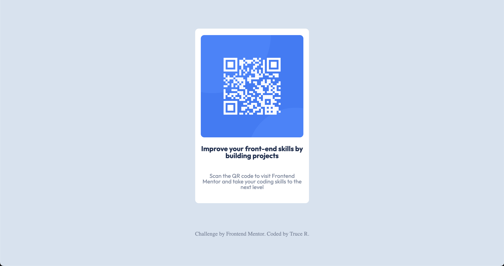

# Frontend Mentor - QR code component solution

## Table of contents

- [Overview](#overview)
  - [Screenshot](#screenshot)
  - [Links](#links)
- [My process](#my-process)
  - [Built with](#built-with)
- [Author](#author)

## Overview

This is a solution to the [QR code component challenge on Frontend Mentor](https://www.frontendmentor.io/challenges/qr-code-component-iux_sIO_H). Frontend Mentor challenges help you improve your coding skills by building realistic projects.

### Screenshot



### Links

- Solution:([Solution](https://www.frontendmentor.io/solutions/qr-code-component-challenge-vRT9RsHLfY))
- Live Site:([Live Site](https://devtruce.github.io/qr-code/))

## My process

I had a fun time building this challenge out its just two flexbox colums so it was quick, simple and fun. I feel like I could have placed the footer a little better but I did not see it in the challenge screenshots so I was unsure of where it was assigned to go.

### Built with

- HTML5
- CSS3
- Flexbox

```html
<body>
  <main class="container">
    <header>
      
    </header>

    <article class="heading">
      <h1>Improve your front-end skills by building projects</h1>
    </article>

    <section class="text">
      <p>
        Scan the QR code to visit Frontend Mentor and take your coding skills to
        the next level
      </p>
    </section>
  </main>
  <footer class="attribution">
    Challenge by
    <a href="https://www.frontendmentor.io?ref=challenge" target="_blank"
      >Frontend Mentor</a
    >. Coded by <a href="https://github.com/DevTruce">Truce R</a>.
  </footer>
</body>
```

```css
* {
  font: 15px;
  text-decoration: none;
  box-sizing: border-box;
  font-family: "Outfit";
}

body {
  background-color: hsl(212, 45%, 89%);
  display: flex;
  min-height: 100vh;
  min-width: 100vw;
  justify-content: center;
  align-items: center;
  flex-direction: column;
}

.container {
  display: flex;
  flex-direction: column;
  align-items: center;
  justify-content: center;
  background-color: hsl(0, 0%, 100%);
  width: 325px;
  height: 500px;
  max-width: 100%;
  max-height: 100%;
  padding: 1rem;
  margin-bottom: 5rem;
  border-radius: 10px;
}

.image {
  max-width: 100%;
  max-height: 100%;
  border-radius: 10px;
}

.heading h1 {
  font-size: 20px;
  font-weight: 700;
  text-align: center;
  padding: 1.25rem 0;
  color: hsl(218, 44%, 22%);
}

.text p {
  font-size: 15;
  font-weight: 400;
  text-align: center;
  padding: 1.25rem 0;
  color: hsl(220, 15%, 55%);
  font-weight: 400;
}

.attribution,
.attribution a {
  color: hsl(220, 15%, 55%);
  font-weight: 400;
}

.attribution a:hover {
  color: hsl(218, 44%, 22%);
  font-weight: 700;
  transition: color, front-weight, 0.5s ease-in-out;
}
```

## Author

- Frontend Mentor - [@DevTruce](https://www.frontendmentor.io/profile/DevTruce)
