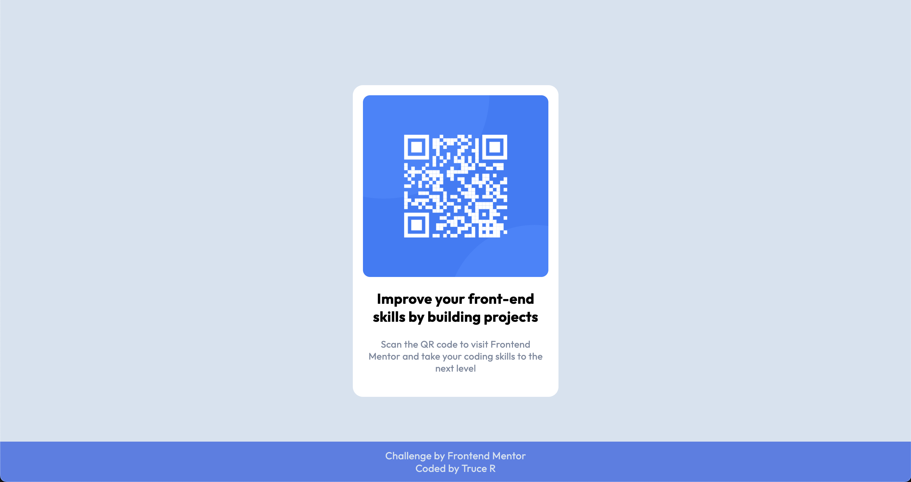
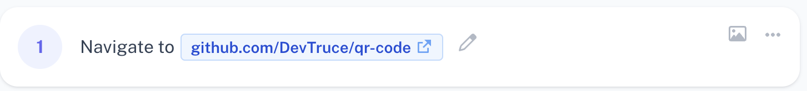
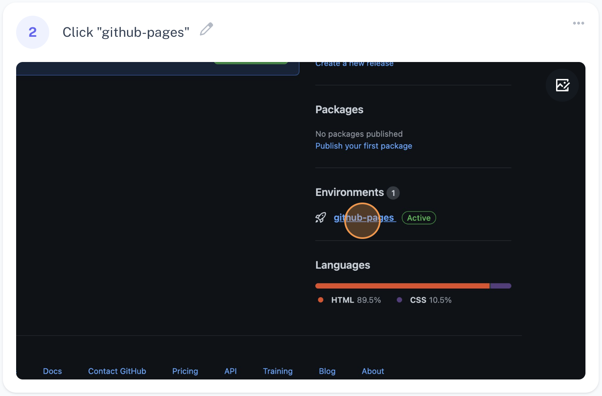

[![Contributors][contributors-shield]][contributors-url]
[![Forks][forks-shield]][forks-url]
[![Stargazers][stars-shield]][stars-url]
[![Issues][issues-shield]][issues-url]
[![MIT License][license-shield]][license-url]
[![LinkedIn][linkedin-shield]][linkedin-url]

<!-- PROJECT LOGO -->
 

  

<h3 align="center">QR Code</h3>

  

    qr code frontend mentor challenge 
     
    <a href="https://github.com/DevTruce/qr-code"><strong>Explore the docs »</strong></a>
     
     
    <a href="https://devtruce.github.io/qr-code/">View Demo</a>
    ·
    <a href="https://github.com/DevTruce/qr-code/issues">Report Bug</a>
    ·
    <a href="https://github.com/DevTruce/qr-code/issues">Request Feature</a>
  

<!-- TABLE OF CONTENTS -->

  
Table of Contents

  <ol>
    <li>
      <a href="#about-the-project">About The Project</a>
      <ul>
        <li><a href="#built-with">Built With</a></li>
      </ul>
    </li>
    <li>
      <a href="#getting-started">Getting Started</a>
    </li>
    <li><a href="#license">License</a></li>
    <li><a href="#contact">Contact</a></li>
  </ol>

<!-- ABOUT THE PROJECT -->

## About The Project

This project is a challenge from [Frontend Mentor](https://www.frontendmentor.io/home), the goal is to build this webpage and make sure it is responsive using the example images given with the challenge.

(<a href="#readme-top">back to top</a>)

### Built With

- [![HTML5][html5.com]][html5-url]
- [![CSS3][css3.com]][css3-url]
  - [![flexbox][flexbox.com]][flexbox-url]
  
(<a href="#readme-top">back to top</a>)

<!-- GETTING STARTED -->

## Getting Started

 
 

(<a href="#readme-top">back to top</a>)

<!-- LICENSE -->

## License

Distributed under the MIT License. See `LICENSE.txt` for more information.

(<a href="#readme-top">back to top</a>)

<!-- CONTACT -->

## Contact

Email: [DevTruce@Gmail.com]()

Discord: [Xzypher#9999]()

Project Link: [Pricing Panel](https://github.com/DevTruce/qr-code)

Frontend Mentor: [Frontend Mentor Profile](https://www.frontendmentor.io/profile/DevTruce)

[Stack Overflow](https://stackoverflow.com/users/16258101/dev-truce) | [Showwcase](https://www.showwcase.com/devtruce) | [Twitter](https://twitter.com/DevTruce) | [Reddit](https://www.reddit.com/user/DevTruce)

(<a href="#readme-top">back to top</a>)

<!-- MARKDOWN LINKS & IMAGES -->
<!-- https://www.markdownguide.org/basic-syntax/#reference-style-links -->

[html5.com]: https://img.shields.io/badge/HTML5-orange?style=for-the-badge&logo=html5&logoColor=white
[html5-url]: https://img.shields.io/badge/HTML5-orange?style=for-the-badge&logo=html5&logoColor=white
[css3.com]: https://img.shields.io/badge/CSS3-blue?style=for-the-badge&logo=CSS3&logoColor=white
[css3-url]: https://img.shields.io/badge/CSS3-blue?style=for-the-badge&logo=CSS3&logoColor=white
[flexbox.com]: https://img.shields.io/badge/flexbox-blue?style=for-the-badge&logo=CSS3&logoColor=white
[flexbox-url]: https://img.shields.io/badge/flexbox-blue?style=for-the-badge&logo=CSS3&logoColor=white
[grid.com]: https://img.shields.io/badge/Grid-blue?style=for-the-badge&logo=CSS3&logoColor=white
[grid-url]: https://img.shields.io/badge/Grid-blue?style=for-the-badge&logo=CSS3&logoColor=white
[contributors-shield]: https://img.shields.io/github/contributors/DevTruce/qr-code.svg?style=for-the-badge
[contributors-url]: https://github.com/DevTruce/qr-code/graphs/contributors
[forks-shield]: https://img.shields.io/github/forks/DevTruce/qr-code.svg?style=for-the-badge
[forks-url]: https://github.com/DevTruce/qr-code/network/members
[stars-shield]: https://img.shields.io/github/stars/DevTruce/qr-code.svg?style=for-the-badge
[stars-url]: https://github.com/DevTruce/qr-code/stargazers
[issues-shield]: https://img.shields.io/github/issues/DevTruce/qr-code.svg?style=for-the-badge
[issues-url]: https://github.com/DevTruce/qr-code/issues
[license-shield]: https://img.shields.io/github/license/DevTruce/qr-code.svg?style=for-the-badge
[license-url]: https://github.com/DevTruce/qr-code/blob/master/LICENSE.txt
[linkedin-shield]: https://img.shields.io/badge/-LinkedIn-black.svg?style=for-the-badge&logo=linkedin&colorB=555
[linkedin-url]: https://www.linkedin.com/in/trucer/
[product-screenshot]: images/screenshot.png
[next.js]: https://img.shields.io/badge/next.js-000000?style=for-the-badge&logo=nextdotjs&logoColor=white
[next-url]: https://nextjs.org/
[react.js]: https://img.shields.io/badge/React-20232A?style=for-the-badge&logo=react&logoColor=61DAFB
[react-url]: https://reactjs.org/
[vue.js]: https://img.shields.io/badge/Vue.js-35495E?style=for-the-badge&logo=vuedotjs&logoColor=4FC08D
[vue-url]: https://vuejs.org/
[angular.io]: https://img.shields.io/badge/Angular-DD0031?style=for-the-badge&logo=angular&logoColor=white
[angular-url]: https://angular.io/
[svelte.dev]: https://img.shields.io/badge/Svelte-4A4A55?style=for-the-badge&logo=svelte&logoColor=FF3E00
[svelte-url]: https://svelte.dev/
[laravel.com]: https://img.shields.io/badge/Laravel-FF2D20?style=for-the-badge&logo=laravel&logoColor=white
[laravel-url]: https://laravel.com
[bootstrap.com]: https://img.shields.io/badge/Bootstrap-563D7C?style=for-the-badge&logo=bootstrap&logoColor=white
[bootstrap-url]: https://getbootstrap.com
[jquery.com]: https://img.shields.io/badge/jQuery-0769AD?style=for-the-badge&logo=jquery&logoColor=white
[jquery-url]: https://jquery.com
